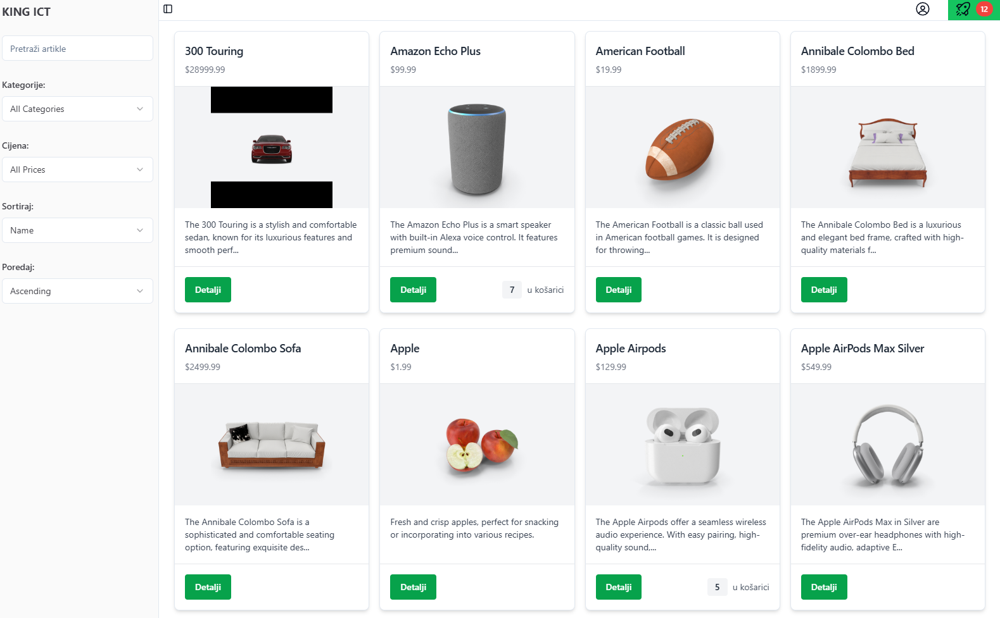

# STOREFRONT

### Aplikacija se može testirati na linku: https://storefront-three-pied.vercel.app/

**Korištene tehnologije:** React, Typescript, Tailwind, shadcn/ui, Vite, Vercel

**API:** dummyjson.com

**Login credentilas**:

- username: **emilys**
- password: **emilyspass**

## Zadatak

- **Prikažite proizvode kao mrežu (slika, naziv, cijena, skraćen opis do 100 znakova), klikom na gumb detalji prikažite u modalu detalje o proizvodu** - &#x2611;

- **Potrebno je implementirati filtriranje po kategoriji i rasponu cijenu (npr. 10$-50$, 50$-100$, 100$+…)** - &#x2611;

- **Potrebno je implementirati sortiranje po cijeni (najviša-najniža, najniža-najviša) i imenu (abecedno)** - &#x2611;

- **Potrebno je implementirati input/traku za pretraživanje po nazivu proizvoda** - &#x2611;

  - input traka pretražuje i filtrira automatski nakon svakog slova. Debounce je 500ms.

- **Potrebno je implementirati paginaciju za upravljanje velikim skupovima podataka (20 proizvoda
  po stranicu neka bude predodređeno)** - &#x2611;

  - paginacija se nalazi na dnu stranice
  - ukupan broj stranica se automatski prilagođava broju filtriranih proizvoda
  - klikanje na "Prethodna stranica" je onemogućeno na stranici 1, a klikanje na "Sljedeća stranica" je onemogućeno na zadnjoj stranici
  - nakon filtriranja/sortiranja vraćamo se na prvu stranicu

- **Implementirati pregled i dodavanje u košaricu (za očuvanje stanja košarice može se koristiti
  lokalna pohrana ili sesija)** - &#x2611;

  - predmeti se mogu dodati u košaricu kada otvorimo detalje o proizvodu
  - može se dodati isti predmet više puta. Nakon dodavanja, pored predmeta će se pojaviti ukupan broj koji je trenutno u košarici
  - na glavnom izborniku pored ikone za košaricu pojavit će se ukupan broj predmeta trenutno u košarici
  - u košarici možemo dodavati/smanjivati proizvode ili potpuno ih maknuti
  - ispod svih predmeta u košarici se vidi ukupna cijena
  - za očuvanje stanja košarice koristimo **session storage** koja se briše ako se preglednik ili tab u kojem je otvorena aplikacija zatvore

- **Potrebno je razlikovati prijavljenog i anonimnog korisnika te mehanizam osvježavanja tokena** - &#x2611;

  - korisnik se može prijaviti koristeći ove podatke(dummyjson.com)
    - username: **emilys**
    - password: **emilyspass**
  - korisnik je upozoren u slučaju netočnog imena ili lozinke
  - nakon prijave pokažu se osnovni podatci o prijavljenom korisniku te se avatar slika u glavnom izborniku promjeni
  - podatci o korisniku, **access token i refresh token** se spremaju u **session storage**
  - u normalnoj aplikaciji sa backendom bi napravili da se access token automatski obnavlja koristeći refresh token nakon određenog vremena, ali ovdje za demonstraciju ga možemo obnoviti klikom na gumb "Refresh token".
  - klikom na "Odjavi se" brišu se svi podatci iz "session storagea" te se korisnik odjavljuje. Isto se događa u slučaju zatvaranja preglednika ili taba

- **Navesti sigurnosne mjere za zaštitu podataka i osiguranje sigurnog prijenosa i pohrane podataka
  (opisno)** - &#x2611;

  - korištenje "access tokena" i "refresh tokena" u kombinaciji sa "session storage" za pohranu osjetljivih podataka
  - izbjegavanje spremanja osjetljivih podataka na klijentu
  - spremanje "Environment Variables" u .env koji se ne pusha na github za lokalni development i dodavanje istih direktno u platformu, npr. Vercel (Faas)
  - https protokol
  - validacija korisničkih unosa na klijentu
  - ažuriranje 3rd party dependency
  - korištenje platforme poput Sentry za monitoring

- **Ukoliko je moguće napraviti generičke komponente koje se mogu ponovo iskoristiti** - &#x2611;
- **Navesti kako bi se rješenje nadograđivalo i održavalo kroz životni ciklus (CI/CD prakse, opisno)** - &#x2611;

  - CI/CD (Continuous Integration/Continuous Deployment) ovise o vrsti aplikacije i strukturi tima koji radi na njoj
  - uobičajeno je integrirati pipeline sličan ovom kojeg sam napravio za ovu aplikaciju. Integracija sa Github actions, tako da prilikom svakog pusha automatiziramo potrebne zadatke (tests, linting, formatiranje koda, optimizacija slika... )
  - u slučaju da je sve u redu kod se automatski deploya na platformu poput Vercel u production ili češće u development environment gdje je spreman za review.
  - nakon odobrenja, pushamo u production gdje je opet povezana sa programima poput Sentry za kontinuirano praćenje mogućih bugova

- **Osigurajte da je dizajn odzivan i pruža optimalno iskustvo pregleda na desktop i mobilnim
  uređajima** - &#x2611;

- **Definirajte i implementirajte testove koje smatrate da su potrebni** - &#x2611;

  - testovi su integrirani koristeći jest, vitest i react testing library
  - povezani su sa Github actions i pokreću se prilikom svakog pusha
  - za lokalno pokretanje koristimo `npm run test`
  - dodao sam ih par u Home i Pagination komponente za demonstraciju

- **Uključite potrebnu dokumentaciju (npr. arhitekturu)** - &#x2611;

  - kao build tool koristimo **Vite**
  - library: **React + TypeScript + Tailwind + shadcn/ui**
  - **src** folder - app components

    - **index.html** -> **index.tsx (Root)** -> **App.tsx (React Router)** / **index.css (Tailwind)**
    - **App.tsx (React Router):**

      - "/" - Layout (component)

        - FilterProvider (react context)

          - Sidebar

            - MenuBar

              - "index" - **Home** (component)
              - "/kosarica" - **Cart** (component)
              - "/auth" - **Authorization** (component)

              ***

              - **Home:**
                - SortControl
                - SearchBar
                - ProductList
                - PriceRangeFilter
                - Pagination
                - OrderControls
                - Category Filter

              ***

              - **Cart**

              ***

              - **Authorization**
                - <u>session storage manipulation</u>

    - **API**

      - "https://dummyjson.com"

    - **components**

      - <u>shadcn/ui</u>

    - **helpers**
      - helper functions
    - **context**
      - context setup
      ***

  - **Deployment**
    - **Github Actions** -> **Github** -> **Vercel**

---

#### Mogući problemi:

Prilikom otvaranja detalja o proizvodu, učitavanje slika može biti sporo. To je zato što slike dolaze sa CDN-a i nepotrebno su velike.

## Korištenje lokalno

1. `npm install`
2. `npm run dev`
3. projekt se automatski otvara u pregledniku
4. `npm run build` build za testiranje produkcijske verzije
5. `npm run preview` pregled produkcijske verzije u pregledniku
6. `npm run test` pokreni vitest
